<picture>
  <source media="(prefers-color-scheme: dark)" srcset="assets/hero-dark.svg">
  <source media="(prefers-color-scheme: light)" srcset="assets/hero-light.svg">
  
</picture>

  &nbsp;
  &nbsp;
  

<picture>
  <source media="(prefers-color-scheme: dark)" srcset="assets/career-dark.svg">
  <source media="(prefers-color-scheme: light)" srcset="assets/career-light.svg">
  
</picture>
